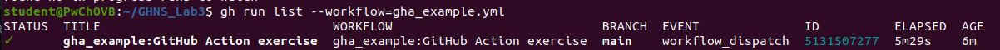

# Laboratorium 3

GitHub Actions - przeglad podstawowych rozwiazan

Plik z zadaniem samodzielnym: .github/workflows/gha_example.yml

Aby sprawdzic liste workflow uzylem polecenia: ```gh workflow list```

Aby uruchomic workflow za pomoca narzędzia Github CLI uzylem polecenia: ```gh workflow run 58797976```

Aby sprawdzic poprawnosc uzylem polecenia: ```gh run list --workflow=gha_example.yml```


